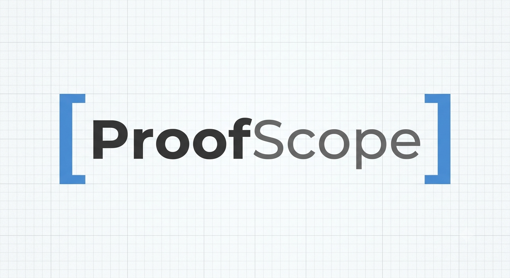

# ProofScope

ProofScope is an enterprise-grade ZKML verification and audit infrastructure. It transforms raw cryptographic proof artifacts into verifiable, tamper-evident audit trails.

## Why ProofScope?
ProofScope bridges the gap between low-level ZK-proof verification and regulatory compliance. It provides not just verification, but **cryptographic accountability**.

- **Cryptographic Ledger:** Every verification result is anchored in an append-only, hash-chained SQLite vault.
- **Diagnostic Transparency:** Maps engine failures to a machine-readable taxonomy (`ERR_001_INVALID_PROOF`, `ERR_002_ENGINE_TIMEOUT`, etc.).
- **Perimeter Hardened:** API-Key gated, path-traversal-proof, and resource-constrained for production ingestion.
- **Evidence-Ready:** Automatically generates PDF/JSON audit bundles for regulatory hand-off.

## Repository Layout
- `/api`: FastAPI gateway, database logic, and security middleware.
- `/bin`: C++ verification engine binaries.
- `/tmp`: Staging area for authenticated proof ingestion.
- `/schemas`: Type-safe audit definitions and diagnostic error enums.

## Security & Compliance
- **Zero-Trust Integrity:** Startup sequence performs a full cryptographic re-replay of the ledger to detect SQL-level tampering.
- **DoS Resilient:** Strict 10MB payload limits and MIME-type enforcement.
- **Sanitization:** Uses UUID-based sandboxing to prevent path traversal attacks.

## License
Distributed under the MIT License. See `LICENSE` for more information.